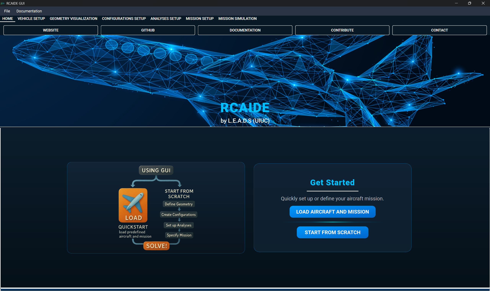
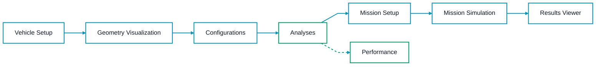
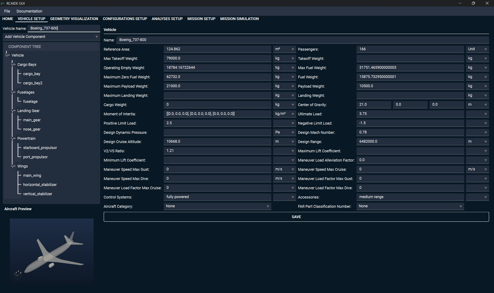
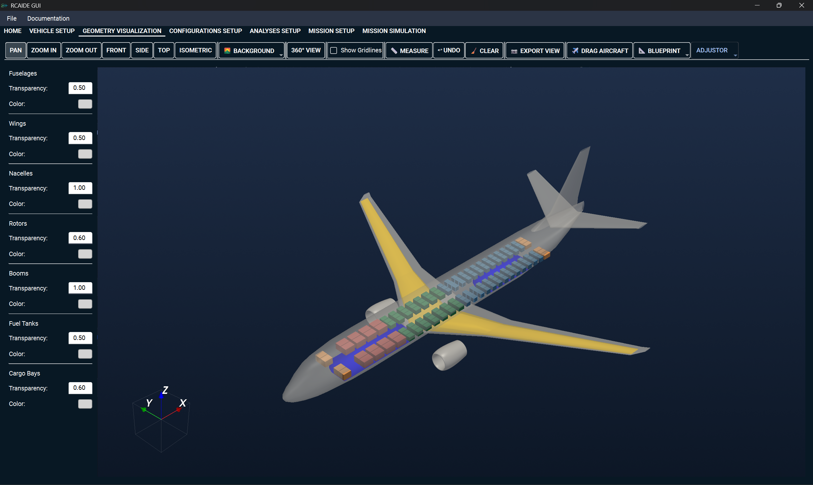
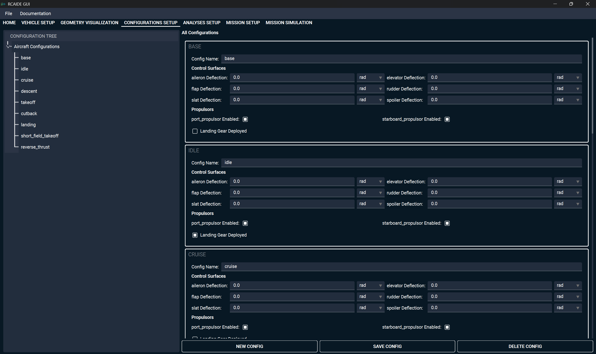
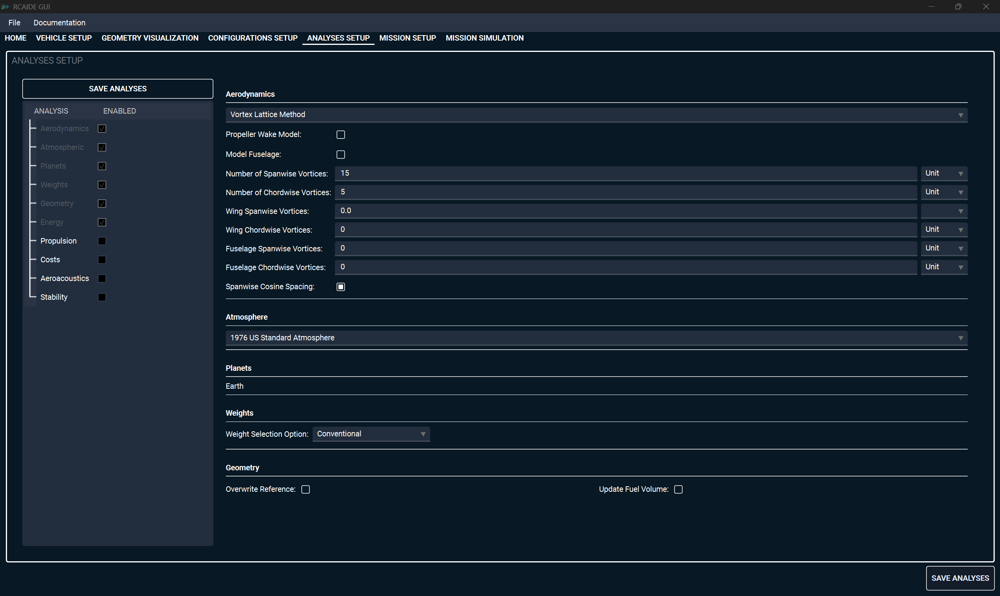
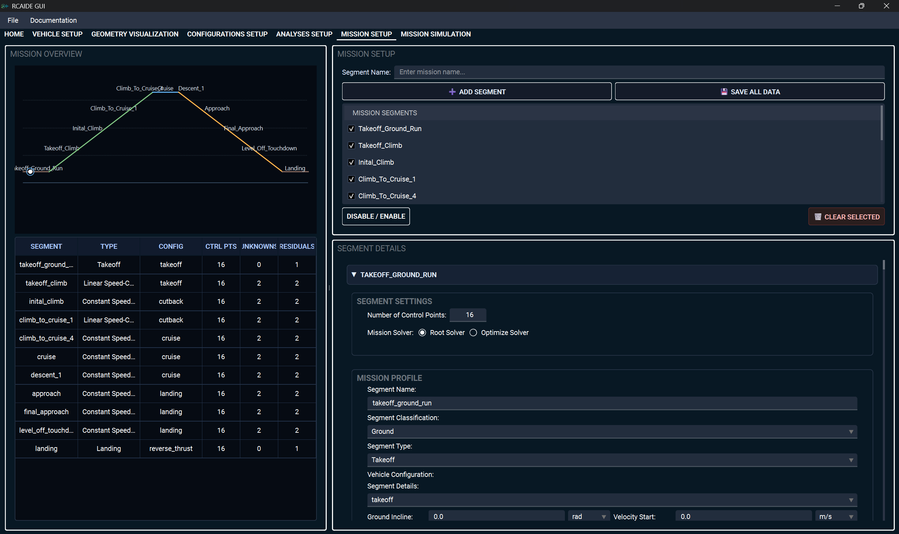
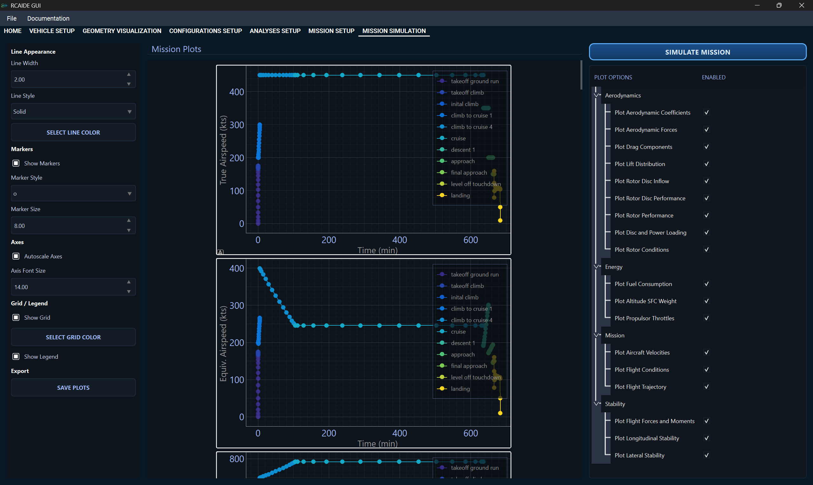
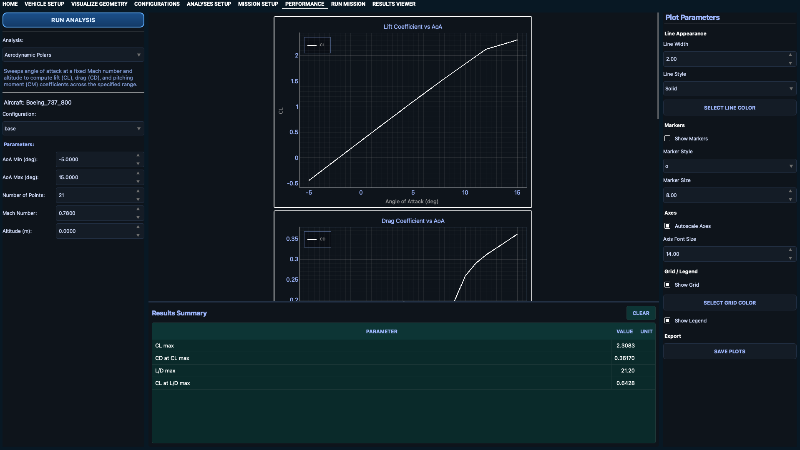
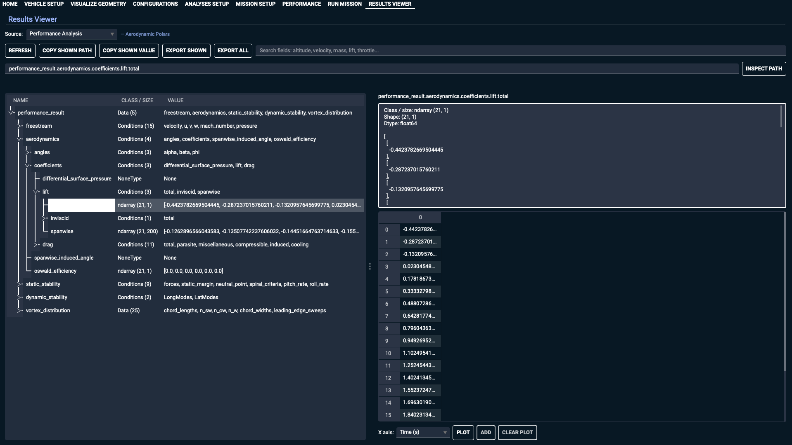

<p align="center">
  
</p>

<p align="center">
  <a href="https://aerospace.illinois.edu">
    
  </a>
  &nbsp;&nbsp;&nbsp;&nbsp;&nbsp;&nbsp;
  <a href="https://www.leadsresearchgroup.com">
    
  </a>
</p>

<p align="center">
  Developed at the <strong>University of Illinois Urbana-Champaign</strong><br>
  <a href="https://www.leadsresearchgroup.com"><strong>Laboratory for Emerging Aircraft Design and Systems (LEADS)</strong></a>
</p>

<h1 align="center">RCAIDE GUI</h1>

<p align="center">
  <strong>A visual aircraft design, analysis, and mission simulation workspace powered by RCAIDE.</strong>
</p>

<p align="center">
  <a href="https://pepy.tech/projects/rcaide-gui">
    
  </a>
  <a href="https://pypi.org/project/RCAIDE-GUI/">
    
  </a>
  <a href="LICENSE">
    
  </a>
  <a href="https://github.com/leadsgroup/RCAIDE_GUI/stargazers">
  
</a>
</p>

<p align="center">
  <a href="https://www.rcaide.leadsresearchgroup.com/gui/">Website</a>
  |
  <a href="https://www.docs.rcaide.leadsresearchgroup.com/install.html">Documentation</a>
</p>

<p align="center">
  
</p>

## What is RCAIDE GUI?

 To make user interaction with [RCAIDE](https://pypi.org/project/RCAIDE-LEADS/) easier and more intuitive, the RCAIDE Graphical User Interface (GUI) was developed. Implemented as a Python desktop application, the GUI provides a structured and visual workflow that guides users through the aircraft design process in a more organized and simplified way. Rather than working with scattered inputs and manual scripting, users can define the vehicle, configure analyses, and construct missions within a single environment. 
 
 The interface is arranged to follow the typical aircraft design workflow, making it easier for users to navigate the design process while reducing the likelihood of technical setup mistakes. By keeping all stages of development within one system, users can focus more on aircraft design decisions rather than software configuration and implementation details.

 Developed and maintained by the [Lab for Electric Aircraft Design and Sustainability](https://www.leadsresearchgroup.com/).

## Quick Start

Install from PyPI:

```bash
pip install RCAIDE-GUI
```

Launch the desktop app:

```bash
rcaide-gui
```

Or run from source:

```bash
python main.py
```

## Design Workflow



## Application Tour

<table>
  <tr>
    <td width="50%">
      <h3>Vehicle Setup</h3>
      <p>The Vehicle Setup tab serves as the foundation of the aircraft design process. Users can create and modify aircraft geometry through a component-based workflow, adding wings, fuselages, landing gear, propulsors, booms, and other vehicle components. A live aircraft preview allows users to verify geometry and placement in real time, while the vehicle details panel provides access to all design parameters and properties.
</p>
    </td>
    <td width="50%">
      
    </td>
  </tr>
  <tr>
    <td width="50%">
      
    </td>
    <td width="50%">
      <h3>Geometry Visualization</h3>
      <p>The Geometry Visualization tab provides a dedicated 3D environment for inspecting aircraft geometry. Powered by VTK, the viewer supports interactive rotation, zooming, measurement tools, customizable colors and transparency, predefined viewing angles, and image export capabilities. This environment allows users to verify component placement and evaluate aircraft geometry before running analyses.</p>
    </td>
  </tr>
  <tr>
    <td width="50%">
      <h3>Configurations Setup</h3>
      <p>The Configurations Setup tab allows users to define aircraft operating states for different phases of flight, including takeoff, cruise, landing, and custom mission conditions. Users can configure control surface deflections, landing gear deployment, and active propulsion systems while maintaining a clear connection to the baseline vehicle geometry. These configurations are later used throughout the mission and analysis workflow.</p>
    </td>
    <td width="50%">
      
    </td>
  </tr>
  <tr>
    <td width="50%">
      
    </td>
    <td width="50%">
      <h3>Analyses Setup</h3>
      <p>The Analyses Setup tab provides access to RCAIDE's multidisciplinary analysis capabilities through a graphical interface. Users can configure aerodynamic methods, atmospheric models, weight estimation approaches, and aeroacoustic settings without directly interacting with Python code. The available options mirror those found within RCAIDE's analysis framework, ensuring consistency between GUI-based and script-based workflows.</p>
    </td>
  </tr>
  <tr>
    <td width="50%">
      <h3>Mission Setup</h3>
      <p>The Mission Setup tab enables users to create complete flight profiles through an intuitive visual workflow. Mission segments such as takeoff, climb, cruise, descent, and landing can be added and customized with specific operating conditions, solver settings, and control points. Each segment can also be linked to previously defined vehicle configurations and analyses, creating a fully integrated mission definition process.</p>
    </td>
    <td width="50%">
      
    </td>
  </tr>
  <tr>
    <td width="50%">
      
    </td>
    <td width="50%">
      <h3>Mission Simulation</h3>
      <p>The Mission Simulation tab is where aircraft designs are evaluated using RCAIDE's analysis framework. Once the vehicle, configurations, analyses, and mission profile have been defined, simulations can be executed directly from the GUI. Results are presented through plots and numerical outputs, including performance metrics, fuel burn, range, energy consumption, flight time, and stability characteristics, which can be exported for further analysis.</p>
    </td>
  </tr>
  <tr>
    <td width="50%">
      <h3>Performance</h3>
      <p>The Performance tab provides dedicated tools for evaluating aircraft-level performance metrics independent of a full mission simulation. Users can generate payload-range diagrams, V-n diagrams, takeoff and landing field length estimates, and aerodynamic polar sweeps directly from the GUI, enabling rapid design-space exploration without constructing a complete mission profile.</p>
    </td>
    <td width="50%">
      
    </td>
  </tr>
  <tr>
    <td width="50%">
      
    </td>
    <td width="50%">
      <h3>Results Viewer</h3>
      <p>The Results Viewer tab allows users to open and inspect saved mission simulation outputs without re-running the solver. Working like a structured data browser, it lets users navigate result variables, review mission output traces, and examine stored data from previous runs, making it easy to compare designs and revisit earlier results.</p>
    </td>
  </tr>
</table>

## Roadmap

| Module | Status | Description |
| --- | --- | --- |
| Optimization | Coming soon | A dedicated optimization tab for running multi-variable design studies and trade-space exploration directly from the GUI, integrated with RCAIDE's optimization framework. |
| AI Agent | Coming soon | A conversational AI assistant embedded in the GUI that can interpret design goals, suggest configurations, flag analysis anomalies, and help users navigate the RCAIDE workflow. |

## Why Use It?

| Capability | What it unlocks |
| --- | --- |
| Visual aircraft setup | Create and modify complex aircraft models without hand-writing setup scripts. |
| Live geometry feedback | Catch sizing, placement, and configuration issues early in the design process. |
| Connected analysis workflow | Move from geometry to configurations, analyses, missions, and results in one desktop environment. |
| RCAIDE integration | Use the same open-source design and analysis ecosystem behind scripted RCAIDE workflows. |

## Requirements

- Python 3.9 or newer
- PyQt6
- pyvista and pyvistaqt
- RCAIDE-LEADS, installed automatically with `RCAIDE-GUI`

For platform-specific setup notes, see the [RCAIDE installation guide](https://www.docs.rcaide.leadsresearchgroup.com/install.html).

## Contributing

Contributions are welcome! If you want to add methods, improve documentation, or fix issues, start with the [RCAIDE contribution guidelines](https://www.docs.rcaide.leadsresearchgroup.com/contributing.html), then open a pull request against this repository.

## Get in Touch

Share feedback, report issues, and request features through [GitHub Issues](https://github.com/leadsgroup/RCAIDE_GUI/issues). For broader discussion with users and maintainers, join [GitHub Discussions](https://github.com/leadsgroup/RCAIDE_LEADS/discussions).
